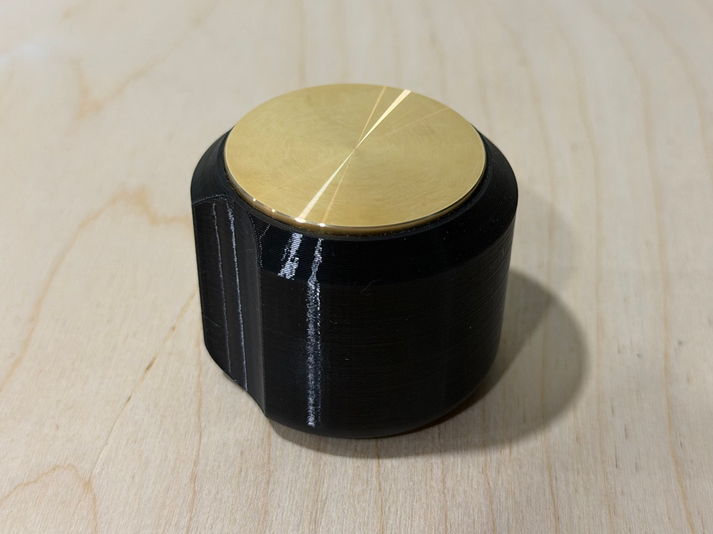
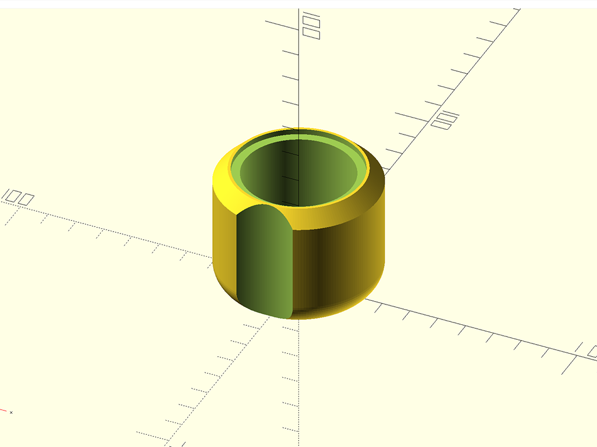
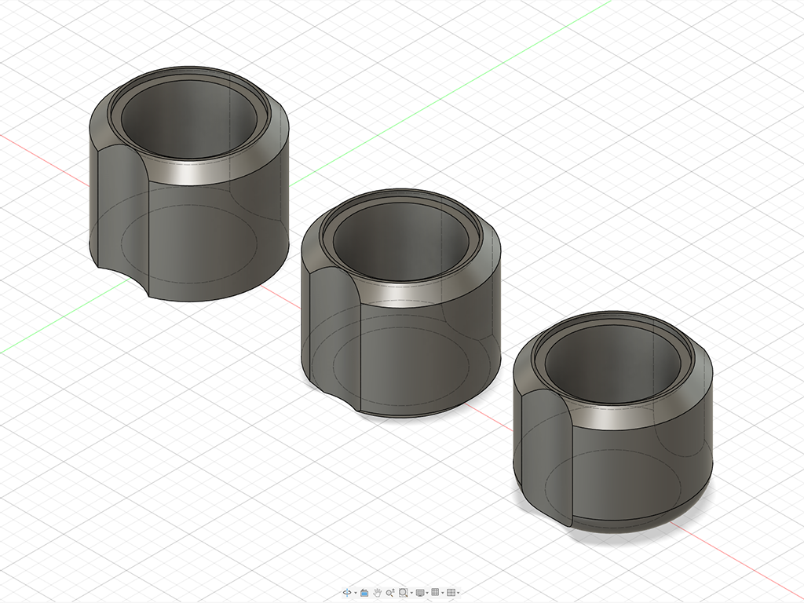

# Parametric Coin Polishing Tool

A single-piece, cylindrical holder and shroud for polishing coin blanks. The tool provides a shallow top recess to seat the coin, a center through-hole, an upper outside chamfer, a configurable bottom edge treatment, and two mirrored finger-indexing scallops on opposite sides of the outer wall. Both source files are fully parametric so you can resize the tool for different coin diameters before exporting for 3D printing.

## Attribution

This design is by [**bradanlane**](https://gitlab.com/bradanlane). The original work is licensed under the **MIT License** in the upstream [**fiber_laser_coins**](https://gitlab.com/bradanlane/fiber_laser_coins) repository. These files are included here with attribution. If you share or adapt the model, please credit the original designer and preserve the upstream license terms.

* [**fiber_laser_coins**](https://gitlab.com/bradanlane/fiber_laser_coins) — Bradan Lane's laser coin documentation and resources (MIT License).
* [**Upstream LICENSE**](https://gitlab.com/bradanlane/fiber_laser_coins/-/blob/main/LICENSE) — MIT License text for the original project.
* [**polishing.md (buffing section)**](https://gitlab.com/bradanlane/fiber_laser_coins/-/blob/main/polishing.md) — Background on the coin buffing/polishing workflow this tool supports.

## Project Files

* [**OpenSCAD Model (.scad)**](./bradan_lane_coin_polishing_tool_configuratable.scad) — Edit the `USER PARAMETERS` block at the top of the file, choose a bottom edge style, render, and export STL.
* [**Fusion 360 Model (.f3d)**](./bradan_lane_coin_polishing_tool_parametric.f3d) — Edit parameters under **Modify > Change Parameters**, then export the bottom-edge variant you want as mesh or STEP.

## Design Logic

The part is built as a hollow cylindrical body with these main features:

1. **Top coin recess:** A shallow pocket on the top face sized to hold the coin blank during polishing.
2. **Center through-hole:** A bore through the full height of the part, sized relative to the coin recess diameter.
3. **Upper outside chamfer:** The outer wall flares outward below the top edge, increasing grip area and overall body diameter.
4. **Bottom edge treatment:** The lower outside edge can be square, filleted, or chamfered. The original design includes all three variants; how you select and export them differs between the two source files (see below).
5. **Double finger wells:** Two vertical cylindrical subtractions on opposite sides of the body create mirrored scallops for consistent hand orientation, matching the original Bradan Lane design.

Most downstream dimensions (pocket diameter, through-hole size, outer body diameter, bottom fillet radius, finger-cut placement) are calculated automatically from the primary user inputs.

## Bottom Edge Variants

The original design includes three bottom-edge options:

| OpenSCAD `bottom_edge_style` | Fusion 360 Body | Description |
| :--- | :--- | :--- |
| `"none"` | **Flat Model** | Sharp lower outside edge with no fillet or chamfer. |
| `"fillet"` | **Fillet Model** | Rounded lower outside edge. Fillet radius is derived from body and inner diameters. |
| `"chamfer"` | **Chamfer Model** | Angled lower outside edge controlled by height and angle parameters. |

All three variants are valid for use. Choose based on personal preference for feel, print orientation, and how cleanly your printer reproduces small fillets or chamfers.

### OpenSCAD

OpenSCAD generates **one variant at a time**. Set `bottom_edge_style` to `"none"`, `"fillet"`, or `"chamfer"`, render the model, and export STL.

The upper outside chamfer is built directly into the rotated 2D side profile.

### Fusion 360

The Fusion file contains **all three printable variants simultaneously** as separate bodies in the browser:

| Browser Item | Role |
| :--- | :--- |
| **Flat Model** | Printable body with a square bottom edge. |
| **Fillet Model** | Printable body with a filleted bottom edge. |
| **Chamfer Model** | Printable body with a chamfered bottom edge. |
| **Main Geometry** *(sketch)* | Drives the primary solid profile shared by all three bodies. |
| **Edge Treatment** *(sketch)* | Supports correct rendering of the upper outside chamfer. Fusion 360 handles this chamfer differently than OpenSCAD, so this sketch is used to preserve the intended top-edge geometry. |

After adjusting parameters, hide or suppress the two bodies you do not want, then export the remaining variant for printing. Do not export the sketch items.

## Customizing the Models

### OpenSCAD

1. Open `bradan_lane_coin_polishing_tool_configuratable.scad` in OpenSCAD.
2. Edit values in the `USER PARAMETERS` section near the top of the file.
3. Set `bottom_edge_style` to the variant you want to export.
4. Use **Design > Render** (F6) before exporting. Fast preview (F5) can occasionally show incomplete geometry around the configurable bottom-edge profile.

Optional render quality: adjust `$fn` at the top of the file. Higher values produce smoother circles but slower renders. Default: `192`.

### Fusion 360

1. Open `bradan_lane_coin_polishing_tool_parametric.f3d` in Fusion 360.
2. Go to **Modify > Change Parameters**.
3. Adjust the user parameters listed below. Derived values update automatically across **Flat Model**, **Fillet Model**, and **Chamfer Model**.
4. In the browser, hide or suppress the two bottom-edge bodies you do not want to print.
5. Export the visible body (**Flat Model**, **Fillet Model**, or **Chamfer Model**) as mesh or STEP for slicing and printing.

The **Main Geometry** and **Edge Treatment** sketches are construction geometry. Leave them in the file so the upper chamfer updates correctly with parameter changes, but do not include them in the export.

### Model Differences

With the current OpenSCAD defaults aligned to the Fusion parameter formulas, the two files produce matching geometry for the same inputs. The meaningful workflow differences are:

| Topic | OpenSCAD | Fusion 360 |
| :--- | :--- | :--- |
| Bottom edge variants | One variant per render via `bottom_edge_style` | **Flat Model**, **Fillet Model**, and **Chamfer Model** all present; export one |
| Upper outside chamfer | Built into the rotated 2D profile | Driven by **Main Geometry** and **Edge Treatment** sketches |
| Circle / mesh resolution | Controlled by `$fn` and the fillet arc step count | Controlled internally by Fusion export settings |
| Authoring workflow | Text parameters, full render required before export | Visual CAD with parameter table and body visibility |

## Parameters

Default values below are shared by both files unless noted otherwise.

### User Parameters

| Parameter | Default | Description |
| :--- | :--- | :--- |
| **overall_height** | `45 mm` | Total vertical height of the part. |
| **coin_dia** | `44 mm` | Nominal coin or blank diameter. |
| **coin_pocket_clearance** | `0.25 mm` | Extra clearance added to the top pocket diameter. |
| **coin_recess_depth** | `2 mm` | Depth of the top coin pocket, measured downward from the top face. |
| **inner_dia_offset** | `6 mm` | Offset subtracted from `coin_recess_dia` to size the center through-hole. |
| **top_outer_dia_offset** | `2 mm` | Offset added to `coin_recess_dia` to size the top outside edge. |
| **chamfer_height** | `5 mm` | Vertical height of the upper outside chamfer. |
| **chamfer_angle** | `45 deg` | Angle of the upper outside chamfer. |
| **bottom_edge_style** | `"fillet"` | Bottom edge mode: `"none"`, `"fillet"`, or `"chamfer"`. **OpenSCAD only.** |
| **bottom_chamfer_height** | `3 mm` | Vertical height of the bottom chamfer. Used when the chamfer variant is selected. |
| **bottom_chamfer_angle** | `45 deg` | Angle of the bottom chamfer. Used when the chamfer variant is selected. |
| **finger_cut_dia** | `36 mm` | Diameter of the cutters used to form the two mirrored finger scallops. |
| **$fn** | `192` | Circle segmentation for OpenSCAD preview/render quality. **OpenSCAD only.** |

### Derived Parameters

These values are calculated automatically in both files. You normally should not edit them directly.

| Parameter | Expression | Value at Defaults |
| :--- | :--- | :--- |
| **coin_recess_dia** | `coin_dia + coin_pocket_clearance` | 44.25 mm |
| **inner_dia** | `coin_recess_dia - inner_dia_offset` | 38.25 mm |
| **top_outer_dia** | `coin_recess_dia + top_outer_dia_offset` | 46.25 mm |
| **top_chamfer_radial_change** | `chamfer_height / tan(chamfer_angle)` | 5.00 mm |
| **body_outer_dia** / **body_outer_d** | `top_outer_dia + top_chamfer_radial_change * 2` | 56.25 mm |
| **body_outer_radius** / **body_outer_r** | `body_outer_dia / 2` or `body_outer_d / 2` | 28.125 mm |
| **top_outer_radius** / **top_outer_r** | `top_outer_dia / 2` | 23.125 mm |
| **bottom_fillet_radius** | `body_outer_radius - (inner_dia / 2)` | 9.00 mm |
| **bottom_chamfer_radial_change** | `bottom_chamfer_height / tan(bottom_chamfer_angle)` | 3.00 mm |
| **finger_cut_radius** | `finger_cut_dia / 2` | 18.00 mm |
| **finger_cut_offset** | `top_outer_radius + finger_cut_radius` | 41.125 mm |

## Usage Notes

1. **Resize for your coin:** Adjust `coin_dia` first, then tweak `coin_pocket_clearance` if the blank needs a looser or tighter fit in the top pocket.
2. **Pick your bottom edge:** In OpenSCAD, set `bottom_edge_style` to `"none"`, `"fillet"`, or `"chamfer"` and render once per variant. In Fusion, export **Flat Model**, **Fillet Model**, or **Chamfer Model** to match. Any of the three variants is fine; the choice is up to you.
3. **Verify derived dimensions:** After changing primary inputs, check `body_outer_dia` and `inner_dia` to confirm the printed part will fit your polishing setup and chuck or fixture.
4. **Polishing workflow:** See Bradan Lane's [polishing guide (buffing section)](https://gitlab.com/bradanlane/fiber_laser_coins/-/blob/main/polishing.md) for context on how this holder fits into the broader coin finishing process.

## Print Settings & Orientation

Suggested starting points based on experience printing the default 44 mm configuration. Orientation and support choices are user preference; the notes below reflect one successful fillet-variant print.

| Variant | Suggested orientation | Notes |
| :--- | :--- | :--- |
| **Fillet Model** / `"fillet"` | Coin pocket facing **down** on the bed | Can produce a clean filleted bottom edge. Autogenerated supports were used for this orientation in testing. |
| **Flat Model** / `"none"` | Flat bottom face **down** on the bed | Simplest orientation for a square lower edge. |
| **Chamfer Model** / `"chamfer"` | User preference | Either pocket-down or flat-down can work; choose based on which surface you want facing the bed. |

Chamfers and fillets may not print as cleanly as the flat variant unless you use a lower layer height and/or a finer nozzle. If edge detail matters, test a small print before committing to a full run.

### Materials

* **PETG:** Used for the reference print. Preferred when sanding or polishing brass or copper coins, since that work can generate heat that may soften or deform **PLA+**.
* **PLA+:** May be acceptable for lighter use, but heat buildup during buffing is a practical concern on coin metals.

### Reference Print Profile (Fillet Variant)

These settings produced a good result with the coin pocket facing down and autogenerated supports enabled:

| Setting | Value |
| :--- | :--- |
| **Filament** | PETG |
| **Layer height** | 0.20 mm |
| **Perimeters / walls** | 4 |
| **Solid top / bottom layers** | 5 |
| **Infill** | 15% Gyroid |
| **Supports** | Autogenerated (pocket-side-down orientation) |

Adjust from this baseline to match your printer, filament, and chosen bottom-edge variant.

## Media

*Printed fillet variant in PETG, sized for a 44 x 3 mm brass coin (pocket-side-down orientation with supports).*

*Fillet variant rendered in OpenSCAD (`bottom_edge_style = "fillet"`).*

*All three bottom-edge bodies in Fusion 360: **Flat Model**, **Chamfer Model**, and **Fillet Model**.*

## License

The original coin polishing tool design by **bradanlane** is licensed under the [**MIT License**](https://gitlab.com/bradanlane/fiber_laser_coins/-/blob/main/LICENSE) in the upstream [**fiber_laser_coins**](https://gitlab.com/bradanlane/fiber_laser_coins) repository.

The OpenSCAD adaptation, Fusion 360 file, and documentation in this folder are provided with attribution to that upstream work. When sharing or modifying these files, include Bradan Lane's copyright notice and the MIT License terms from the upstream project.

Other materials in this repository may be licensed separately. See the [`LICENSE`](../../LICENSE) file in the repository root for the **Creative Commons Attribution 4.0 International (CC BY 4.0)** license that applies to original content in this collection.
