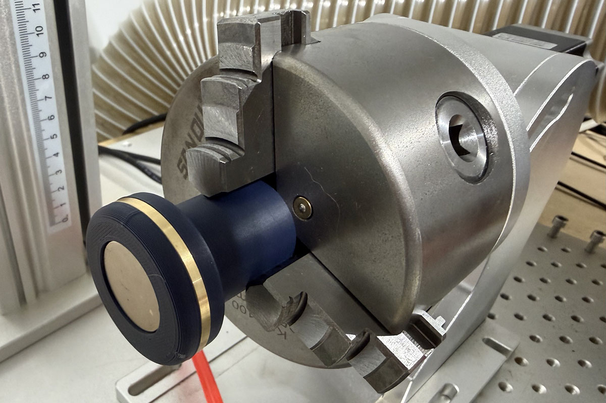
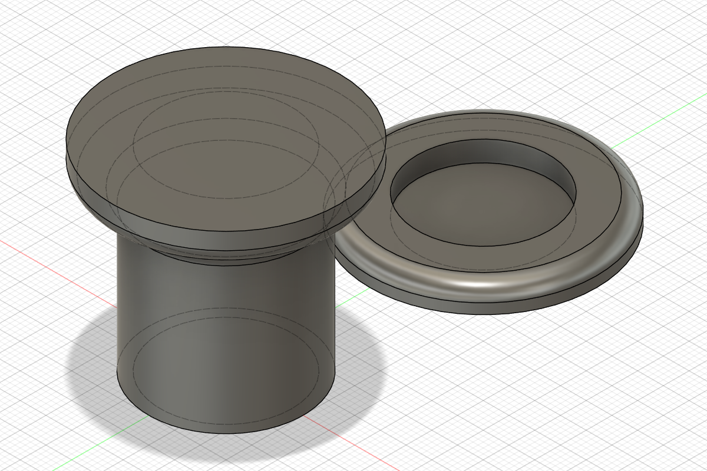

# Parametric Coin Edge Engraving Jig

This project provides a two-part parametric clamping system designed for fiber laser edge engraving on non-ferrous coins. By using recessed neodymium magnets, the jig holds the coin securely between a base and a cap, leaving the entire 360° circumference of the coin edge exposed and unobstructed for the laser.

## Design Logic

The jig consists of two 3D-printed components:
1. **The Base:** Features a stem for mounting into a rotary chuck and a recessed pocket for an N52 magnet.
2. **The Cap:** Sits on top of the coin and contains a matching magnet pocket.

The magnets are positioned to attract one another, creating a clamping force that holds the coin in place. Both parts are designed with 1mm of filament material separating the magnet from the contact surface to protect the coin and ensure a consistent focal distance.

The transition between the mounting stem and the jig plate uses a lofted profile. To ensure the part remains 3D-printable without supports, the `HeightOffset` is automatically calculated based on the user-defined `AngleLoft`.

### Automatic Offset Calculation
The distance between the stem and the plate is calculated using the following formula to maintain a consistent print angle:

`abs(DiameterBase - DiameterCoin) / 2 * tan(AngleLoft)`

## Technical Specifications

### Parameters
The Fusion360 file (`.f3d`) is fully parametric. You can adjust the following variables in the **Modify > Change Parameters** menu to suit your specific rotary setup or coin size:

| Parameter | Initial Value | Description |
| :--- | :--- | :--- |
| **DiameterBase** | 30mm | Diameter of the stem that fits into your rotary chuck jaws. |
| **DiameterCoin** | 44mm | Matches the diameter of your coin blank (e.g., H62 Brass). |
| **DiameterMagnet** | 25.55mm | Diameter of the magnet pocket (includes tolerance for press-fit). |
| **HeightMagnet** | 3.2mm | Depth of the pocket for the magnet. |
| **HeightBase** | 30mm | Total height of the mounting stem (should clear chuck jaws). |
| **HeightJigPlate** | 5mm | Thickness of the plate the coin rests upon. |
| **AngleLoft** | 30° | The overhang angle for the transition between stem and plate. |
| **HeightOffset** | *Formula* | Calculated distance to maintain the specified loft angle. |
| **FilletSize** | 3mm | Radius for rounding off the jig plate and loft transitions. |

### Materials & Components
* **Filament:** SUNLU PLA+ 2.0
* **Magnets:** 2x N52 Rare Earth Magnets (1 in x 1/8 in Neodymium Disks)
    * **Source:** [Applied Magnets (ND055-N52)](https://appliedmagnets.com/n52-rare-earth-magnets-1-in-x-1-8-in-neodymium-disk/)

## Assembly & Usage

1. **Print Settings & Orientation:** * **Orientation (Base):** Rotate the Base 180° in your slicer. It should be printed **face side down** (the flat plate on the bed) and the hollow stem at the top for ease of print and better surface accuracy.
   * **Nozzle:** 0.4mm
   * **Profile:** 0.20mm STRUCTURAL (modified)
   * **Walls:** 3
   * **Infill:** 15% 
   * **Speed:** Slowed to 75% (M220 S75) for improved surface finish and accuracy.
   * No supports are necessary if the `AngleLoft` is kept within your printer's capabilities.
2. **Magnet Insertion:** Press-fit one magnet into the Base and one into the Cap. **Ensure polarities are aligned** so the two halves attract each other. The pockets are designed for a tight friction fit; no adhesive should be required.
3. **Mounting:** Secure the Base stem into your rotary chuck. 
4. **Engraving:** Place the coin on the Base, then place the Cap on top. The magnetic force will center and clamp the coin. Because the jig is concentric with the stem, it allows for clean, continuous 360° edge engraving.

## Media

*Finished jig holding a 44mm brass coin.*

*Parametric model overview in Fusion 360.*

## License
This project is licensed under the **Creative Commons Attribution 4.0 International (CC BY 4.0)** license. See the `LICENSE` file in the repository root for full details.
