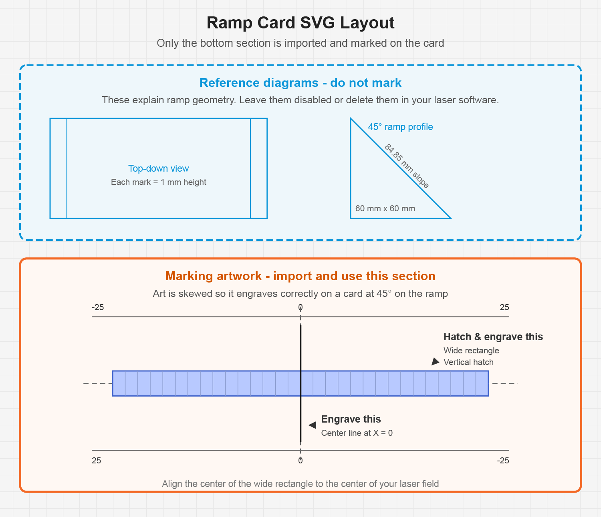
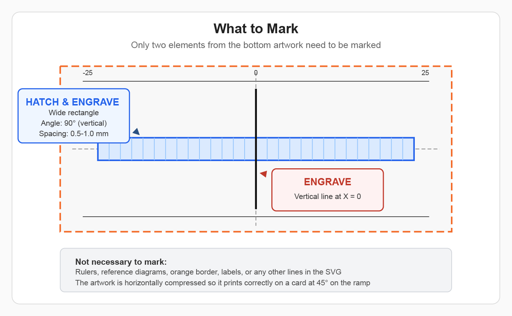
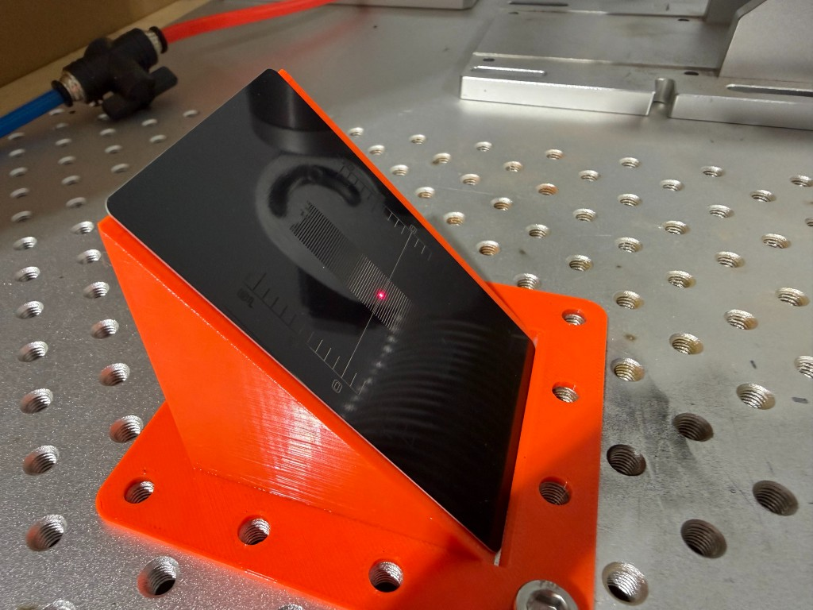
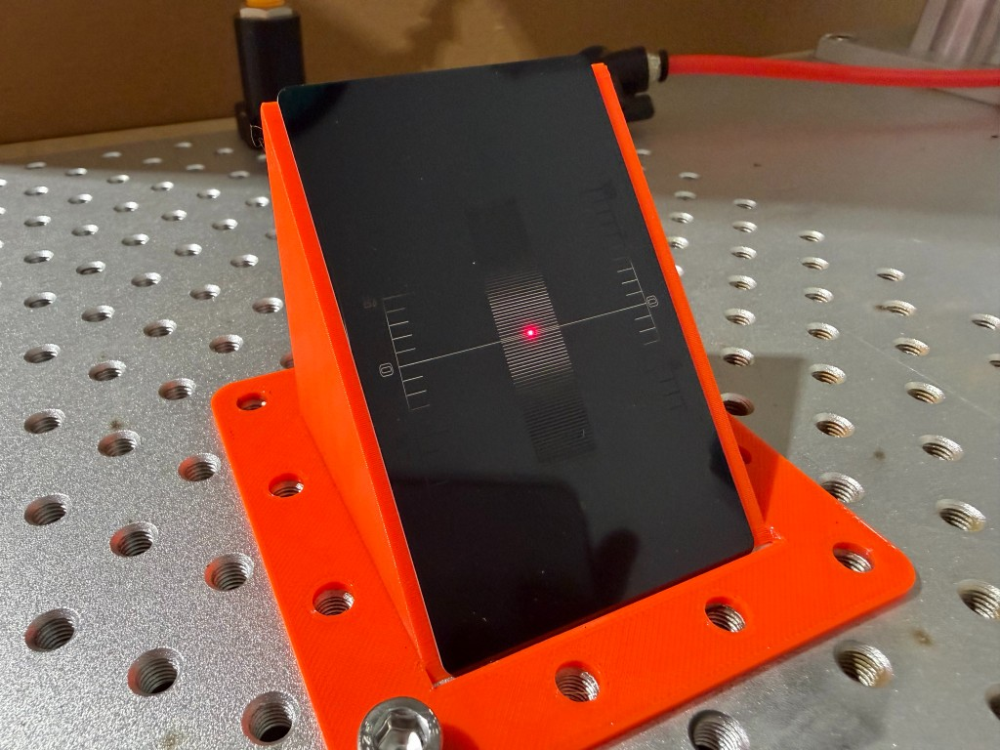
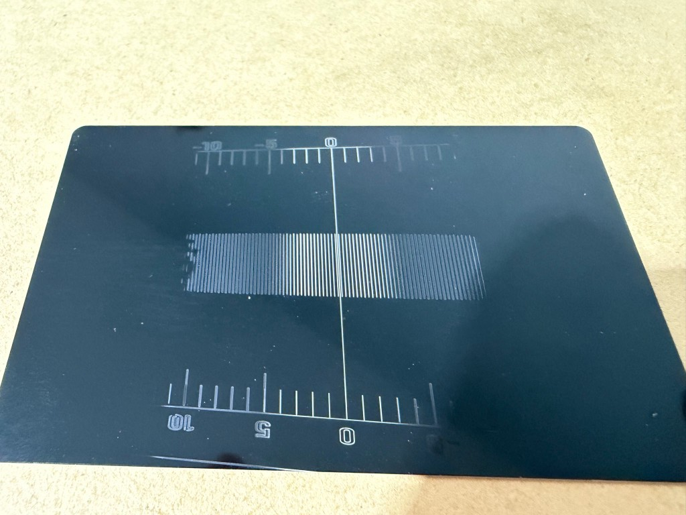

# Ramp Card Focus Calibration Procedure

This procedure describes how to use a ramp card focus test to determine the true focal distance for a fiber laser lens. The process is software-agnostic and can be used with EZCAD, LightBurn, or other laser marking software capable of importing the calibration artwork and applying a hatch/fill pattern.

## Referenced Files

### Fatlab Designs Focus Tools

The Fatlab Designs focus height calibration card and ramp stand files were created by Fatlab Designs and are included courtesy of:

    http://fatlabdesigns.com/

These files were made available by the creator through laser community groups. To the best of my knowledge, they are not currently hosted on the Fatlab Designs website. Attribution is provided here based on the creator name.

- [Fatlab Designs Focus Height Calibration Ramp Card SVG](mechanical/fatlab-designs-focus-tools/fatlab_designs_focus_height_calibration_ramp_card.svg)
- [Fatlab Designs Focus Height Calibration Ramp Left Leg STL](mechanical/fatlab-designs-focus-tools/fatlab_designs_focus_height_calibration_ramp_left.stl)
- [Fatlab Designs Focus Height Calibration Ramp Right Leg STL](mechanical/fatlab-designs-focus-tools/fatlab_designs_focus_height_calibration_ramp_right.stl)

### Ramp Card Jig

The ramp card jig is my own design and is licensed separately under the Creative Commons Attribution 4.0 International License, as included in the ZIP file.

- [Ramp Card Jig ZIP](mechanical/ramp-card-jig/ramp_card_jig.zip)

## Required Materials

- Fatlab Designs ramp card SVG calibration artwork
- Either:
  - Fatlab Designs ramp stand left and right STL files, or
  - Ramp card jig
- Standard black aluminum business cards
  - Typical size: 54 mm x 86 mm x 0.4 mm
- Fiber laser with the lens being calibrated installed
- Laser marking software capable of importing SVG artwork and applying hatch/fill settings
- Calipers, focus stick, or another reliable method for recording the resulting focal distance

## Purpose

A ramp card test helps identify the true focal point of a laser lens by placing the test card at a known angle relative to the laser beam. As the laser marks across the angled card, different portions of the card pass through the focal plane.

The goal is to determine where the laser is most tightly focused by comparing the marked hatch band against the fixed center reference line in the calibration artwork.

This process should be repeated separately for each lens.

## Understanding the SVG Artwork

The Fatlab Designs ramp card SVG contains three distinct sections. **Only the bottom section is used for marking.** The top two sections are reference diagrams that explain ramp geometry and should not be engraved.

### Reference diagrams (top — do not mark)

The blue diagrams at the top of the SVG are informational only:

- **Top-down view** — shows how height marks relate to the ramp card
- **Side profile** — shows the 45° ramp geometry (60 mm base, 60 mm height, 84.85 mm slope)

Disable or delete these layers in your laser software. They are not part of the focus test.

### Marking artwork (bottom — this is what you use)

The bottom section, enclosed in an orange border, is the artwork you import and mark. It is intentionally **skewed**: the narrow dimension is correctly sized, but the long dimension is horizontally compressed so the pattern engraves with correct proportions on a card sitting at 45° on the ramp.

The marking artwork is aligned on the **(0, 0) origin** — the intersection of the vertical and horizontal center guides in the file. When setting up the job, align the **center of the wide rectangle** to the **center of your laser field**.

### What to actually mark

Only two elements from the bottom artwork need to be marked:

| Element | Operation | Notes |
| :--- | :--- | :--- |
| **Wide horizontal rectangle** | Hatch (fill) | Vertical hatch, 0.5–1.0 mm line spacing |
| **Vertical line at X = 0** | Vector engrave | Fixed center reference line |

It is not necessary to mark the rulers, orange border, reference labels, or any other lines in the SVG. When I run this test, those two elements are the only ones I bother marking.

## Important Focus Height Offset

The ramp card process identifies the focus position at the midpoint of the angled card.

Because the card sits at a 45-degree angle, that midpoint is **30 mm above the laser bed**. This is consistent with the SVG calibration artwork, which includes a defined vector center line positioned precisely at the midpoint of the card.

Because of that, the actual focus position at the bed is 30 mm lower than the position determined during this test.

In other words:

    Ramp card midpoint focus position = focus at 30 mm above the bed
    Actual bed-level focus position = ramp card midpoint focus position minus 30 mm

When recording the result, be clear whether the measurement represents the ramp card midpoint focus position or the adjusted bed-level focus position.

The goal is to have the laser focused at the **middle of the ramp** — the 30 mm mark. On a manually focused galvo column, you adjust height until the hatch band centers on the fixed reference line. Auto-focusing machines may handle initial focus differently; the ramp card test still validates where the beam is tightest relative to that 30 mm midpoint, but the procedure for getting there depends on your hardware.

## Important Concept

The ramp card includes a fixed center reference line (the zero-line) and a hatched test area. When the test is run, the position of the sharpest hatch band shifts relative to the zero-line depending on focus height. The zero-line and ruler do not move — only the apparent location of the in-focus hatch changes.

This can feel counterintuitive. Remember to adjust focus in the **opposite direction** of where the sharpest hatch appears. See [Reading the Result](#reading-the-result) for photos and a hatch-line counting method to estimate how far to move.

## Preparing the Artwork

Import the SVG calibration card into your laser marking software.

Use only the **bottom marking section**. Disable or delete the top reference diagrams.

Assign operations to exactly two elements:

1. **Wide horizontal rectangle** — apply a hatch/fill
2. **Vertical center line at X = 0** — mark as a vector line only

Recommended hatch settings:

    Hatch angle: 90 degrees (vertical lines)
    Line spacing: 0.5 mm to 1.0 mm

A wide hatch spacing is preferred. The purpose of the test is not to engrave a solid filled area, but to make the focal band easy to see.

Everything else in the SVG should be left disabled or deleted.

## Preparing the Ramp

Place a black aluminum business card into the ramp or jig.

The card should be seated consistently each time. Any change in card position can affect the apparent result.

For best repeatability, the ramp or jig should be fixed to the laser bed. My ramp card jig is designed to bolt to the bed with the center of the ramp aligned to the laser's home position.

Position the center of the ramp directly under the laser. Align the center of the wide rectangle in the artwork to the center of your laser field.

## Running the Test

Use low power for the ramp card test.

On my 100 W MOPA fiber laser, I usually start around:

    Power: 8%

This gives a wide enough marking band to see approximately where focus is. As you fine-tune, **lower the power** until you are working with a very narrow field of focus.

More power widens the functional engraving field — a higher-power mark will show a broader in-focus band, which makes it harder to pinpoint the exact focal position. Lower power narrows that band and makes it easier to see where the fixed center line falls relative to the sharpest part of the hatch.

The laser should not engrave the entire card clearly when it is out of focus. That is expected and useful. The goal is to identify the area where the mark is sharpest and most visible.

Run the test and inspect the relationship between the hatched band and the fixed center line.

## Reading the Result

The example above was marked at **8% power** on my 100 W laser. That is higher than I would use for final fine-tuning, but it makes the result easier to see and photograph, and helps show whether focus is close or far off. For the final adjustment pass, lower the power further to narrow the visible focus band.

The distortion visible in the engraved ruler is normal and expected. The card is being marked at an angle on the ramp, so the ruler lines will not look square to the card edges when viewed flat. The ruler and zero-line are **reference marks only**. Changing the machine focus height does not move the zero-line or the ruler. It only changes where the rectangular hatch appears most sharply focused on the ramp.

### What to look for

The goal is to find the **center of the most solid, brightest, or cleanest portion** of the engraved hatch. In the example above, the hatch lines are brightest and most consistent in a band near the center of the card, with the marks fading toward the top and bottom where the card is further from the focal plane.

If that center is not aligned with the zero-line, adjust the machine focus in the **opposite direction** of where the sharpest hatch area appears:

- Sharpest hatch **below** the zero-line → raise the focus position
- Sharpest hatch **above** the zero-line → lower the focus position

### Estimating the adjustment

To estimate how far to move focus before re-running the test:

1. Look at the engraved hatch and identify the section where the lines are most solid and consistent.
2. Estimate the center of that solid section.
3. Count how many hatch lines separate that center from the zero-line.
4. Multiply by the hatch spacing used in the test.

    Adjustment ≈ number of hatch lines × hatch spacing

For example, with **0.5 mm hatch spacing**:

    4 lines × 0.5 mm = 2.0 mm adjustment

With **1.0 mm hatch spacing**:

    4 lines × 1.0 mm = 4.0 mm adjustment

Move focus in the **opposite direction** of where the best-marked hatch area appears relative to the zero-line. Then re-run the test and repeat until the center of the sharpest hatch band aligns with the zero-line.

The goal is to make the hatched band centered on the fixed center line.

## Recording the Focus Position

Once the hatch band is centered on the fixed center line, record the focus position.

This position represents the true focal distance at the midpoint of the angled ramp card. Since that midpoint is 30 mm above the laser bed, subtract 30 mm to determine the equivalent focus position at the bed surface.

For example:

    Measured ramp card midpoint focus position: 200 mm
    Ramp card midpoint height above bed: 30 mm
    Equivalent bed-level focus position: 170 mm

Because many galvo columns cannot be adjusted numerically with high precision, it is useful to create a physical focus stick or spacer that fits between the lens housing and the material surface. This makes it easier to return to the same focus height later, even when using materials of different thicknesses.

When making a focus stick or spacer, use the focus distance that corresponds to the actual material surface being marked, not the unadjusted ramp card height.

## Repeat for Each Lens

This procedure must be repeated for each lens.

Each lens has its own focal distance, and the actual working distance may vary from the nominal value provided by the manufacturer.

Do not assume that the focus position for one lens applies to another lens.
