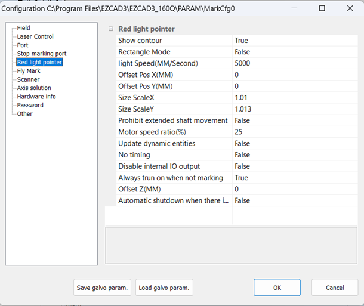
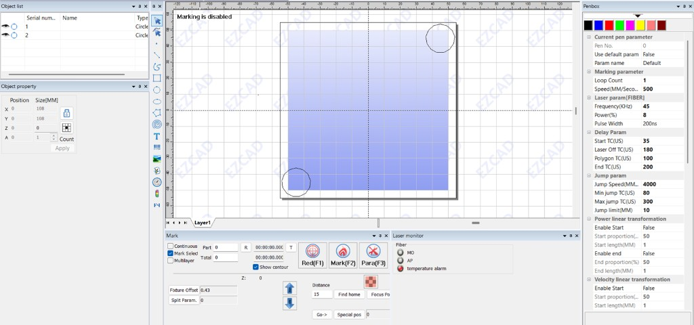

# Red Light Preview Calibration Procedure (EZCAD3)

Align the visible red light preview with the actual fiber laser path. This procedure describes **EZCAD3** settings only. Other laser marking software, such as LightBurn, provides its own red light alignment controls and is not covered here.

## When to Perform This Procedure

Red light preview calibration has only been required during **initial laser setup**. Once set, the values have remained consistent across lens and galvo changes, which suggests the offset is largely internal to the laser source.

Repeat this procedure if the **laser source** is replaced or changed, or if red light alignment clearly drifts over time. Lens or galvo changes have not required re-calibration in this setup.

## Prerequisites

* Focus must be dialed in for the lens and material thickness in use before starting. Calibrating red light preview offsets while out of focus is not recommended.
* Software lens correction (`.COR`) does not need to be complete first.

## Red Light Pointer Settings

Open **Parameters (F3)** and select **Red light pointer**. Adjust these values during calibration:

| Parameter | Starting value |
| :--- | :--- |
| Size ScaleX | `1.0` |
| Size ScaleY | `1.0` |
| Offset Pos X | `0.0` |
| Offset Pos Y | `0.0` |

These parameters affect the **red light preview only**. They do not change where the fiber laser fires.

## Test Layout

Create two 18 mm diameter vector circles (no hatch):

* One at the bottom-left of the field
* One at the top-right of the field

Avoid the center and extreme edges of the lens field. Precise placement is not critical. This workflow used a 210 mm lens with circles at approximately (-90, 90) and (90, -90).

## Procedure

### 1. Mark the reference circles

Tape **black anodized aluminum business cards** to the bed. Each circle is marked once with the fiber laser. That pass removes the black anodization and leaves a fine aluminum outline showing exactly where the beam fired. You need those outlines to judge alignment: the red light preview alone does not tell you how closely it tracks the laser path.

Set focus height (or Z offset) for the thickness of the business cards, not the bare bed. Pen values below were used on the YDFLP-100-M7-M-R; adjust for your laser source as needed. The goal is clean anodization removal without heavy engraving.

| Parameter | Value |
| :--- | :--- |
| Pen | 0 |
| Loop count | 1 |
| Mark speed | 500 mm/s |
| Frequency | 45 kHz |
| Power | 8% |
| Pulse width | 200 ns |

1. Use **Red (F1)** preview on one circle at a time to position a card on the bed.
2. Tape each card down so it cannot move for the rest of the procedure.
3. Once both cards are fixed, mark each circle once with the fiber laser.
4. **Do not mark again** during adjustment. All further work is preview-only.

### 2. Adjust the red light preview

1. Make small changes to one parameter at a time: `Size ScaleX`, `Size ScaleY`, `Offset Pos X`, or `Offset Pos Y`.
2. Tune one plane satisfactorily before moving to the other (for example, finish X scale/offset before Y scale/offset).
3. After each change, compare the red light preview to the aluminum outlines on both cards (the areas where the laser removed the black anodization).

Any adjustment affects the entire preview field, so check both circles every time.

Stop when the red light preview looks reasonably aligned with those outlines. There is no fixed numeric tolerance.
