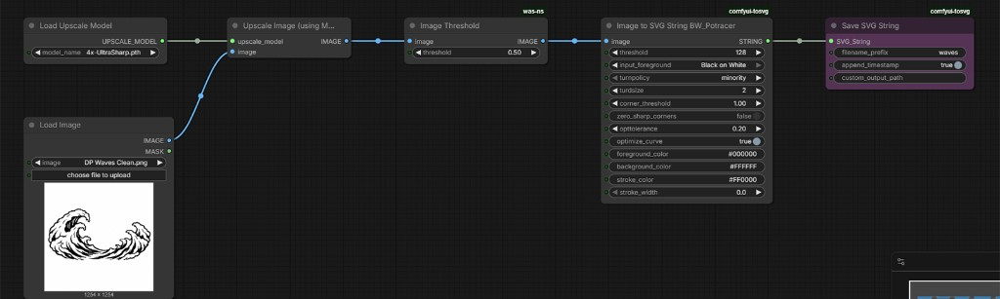

# Black and White Raster to SVG (ComfyUI)

ComfyUI workflow for converting black-and-white raster artwork into SVG paths suitable for fiber laser layout and engraving prep.

Installing, deploying, and configuring ComfyUI itself is beyond the scope of this document. It assumes you already have a working ComfyUI setup and can install custom node packs from the repositories listed below (or through an integrated extension manager).

Later steps reference **Adobe Illustrator** and **EZCAD3** because that is the workflow used on this platform. You do not need those specific applications to use the SVG output. Other vector editors and laser marking software, including LightBurn and EZCAD2, work fine as well.

## Workflow File

* [**Download workflow JSON**](./comfyui_black_and_white_raster_to_svg_conversion_workflow.json)

Import this file in ComfyUI via **Load** or drag-and-drop onto the canvas.

## Required Node Packs

| Pack | Version | Author | Repository |
| :--- | :--- | :--- | :--- |
| WAS Node Suite (Revised) | 3.0.1 | Dr.Lt.Data | [ltdrdata/was-node-suite-comfyui](https://github.com/ltdrdata/was-node-suite-comfyui) |
| ComfyUI-ToSVG-Potracer | 1.3.1 | ImagineerNL | [ImagineerNL/ComfyUI-ToSVG-Potracer](https://github.com/ImagineerNL/ComfyUI-ToSVG-Potracer) |

ComfyUI core nodes are also used for loading, upscaling, and saving images.

| Node | Pack |
| :--- | :--- |
| Load Upscale Model | ComfyUI core |
| Load Image | ComfyUI core |
| Upscale Image (using Model) | ComfyUI core |
| Image Threshold | WAS Node Suite (Revised) *(optional)* |
| Image to SVG String BW_Potracer | ComfyUI-ToSVG-Potracer |
| Save SVG String | ComfyUI-ToSVG-Potracer |

## Upscale Model

Download **`4x-UltraSharp.pth`** from [lokCX/4x-Ultrasharp on Hugging Face](https://huggingface.co/lokCX/4x-Ultrasharp/blob/main/4x-UltraSharp.pth) and place it in your ComfyUI upscale models folder. Select it in **Load Upscale Model**.

## Workflow Overview

The pipeline runs in this order:

1. **Load Upscale Model** and **Load Image**
2. **Upscale Image (using Model)** at 4×
3. **Image Threshold** to normalize black and white *(optional; see notes below)*
4. **Image to SVG String BW_Potracer** to trace paths with Potrace
5. **Save SVG String** to write the SVG file

With **`optimize_curve`** enabled on the Potracer node, the output is an optimized SVG. Given a sufficiently clean black-and-white source image, the resulting SVGs have been more than adequate for engraving use here without heavy manual cleanup.

## Node Settings

Default values from the included workflow JSON:

| Node | Setting | Value |
| :--- | :--- | :--- |
| **Load Upscale Model** | model_name | `4x-UltraSharp.pth` |
| **Image Threshold** | threshold | `0.50` |
| **Image to SVG String BW_Potracer** | threshold | `128` |
| | input_foreground | Black on White |
| | turnpolicy | minority |
| | turdsize | `2` |
| | corner_threshold | `1.00` |
| | zero_sharp_corners | false |
| | opttolerance | `0.20` |
| | optimize_curve | true |
| | foreground_color | `#000000` |
| | background_color | `#FFFFFF` |
| | stroke_color | `#FF0000` |
| | stroke_width | `0.0` |
| **Save SVG String** | filename_prefix | `bwlogo_svg` |
| | append_timestamp | true |
| | custom_output_path | *(empty)* |

Adjust **filename_prefix** and **Load Image** for each job. Tune Potrace settings if the source art has noise, gray pixels, or fine detail that needs preserving or filtering.

**Image Threshold:** This step is included in the workflow but may not be strictly necessary. **Image to SVG String BW_Potracer** has its own **threshold** setting (default `128`). Try bypassing or removing **Image Threshold** if the source is already a clean black-and-white raster.

**Inverted art:** Default **input_foreground** is **Black on White**. If the source has a white foreground on a black background, change **input_foreground** to **White on Black**.

## Usage

1. Install the required node packs (or use an integrated extension manager) and the `4x-UltraSharp.pth` upscale model.
2. Load the workflow JSON in ComfyUI.
3. Select your source raster in **Load Image** (black-and-white or high-contrast artwork works best).
4. Set **Save SVG String** `filename_prefix` if desired.
5. Queue the workflow and collect the SVG from the ComfyUI output folder.
6. Continue layout and cleanup in Adobe Illustrator or other vector editing software, then export for your laser marking software (EZCAD3 in this workflow).

## Output

With default settings, SVG files are saved with the configured prefix and a timestamp appended to the filename. Leave **custom_output_path** empty to use the ComfyUI default output directory, or set a path to write elsewhere.

Each saved SVG contains **two layers**:

1. **Art layer:** The traced vector paths from the input artwork.
2. **Background fill layer:** A solid rectangle filled with the configured **background_color** (default `#FFFFFF`).

When importing into vector editing software or laser marking software, hide or remove the background layer if you only need the cut/engrave paths.
